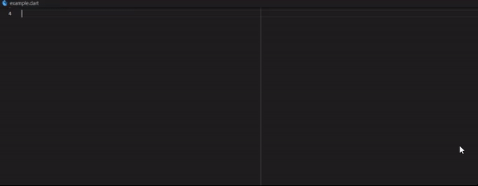

# Empire Flutter Snippets

<p align="center">
    
</p>

This extension contains Flutter code snippets for the [Empire State Management package](https://pub.dev/packages/empire).

## Snippets

| Trigger  | Content |
| :------- | ------- |
| `empirevm` | Create a new ```EmpireViewModel``` <br /><br />   |
| `empirewidget` | Create a new ```EmpireWidget```<br /><br />   |

## Requirements

Dart version 2.17 or greater.

Flutter version 3.0.0 or greater.

A reference to Empire version 0.9.0 or greater in your pubspec.yaml.

## Reporting issues

If you discover any issues with this extension please file an issue on the [Empire](https://github.com/strivesolutions/flutter_empire/issues) repository.

## Release Notes
### 0.1.0

Initial release of Empire Flutter Snippets.

